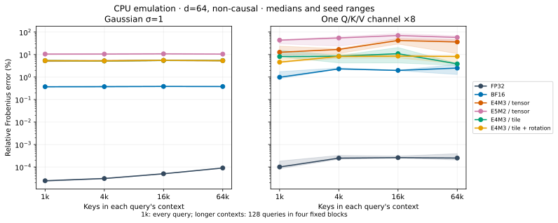

# attention-numerics

This is a NumPy emulation of rounding error in tiled BF16 and FP8 attention, **not a measurement on GPU hardware**.

**Question:** How much error comes from low-precision inputs and accumulation, how does context length change it, and which fixes help?

[attention.py](attention.py) models storage conversion, 32-product reductions, a shared-exponent reduced14 accumulator, online softmax, probability conversion and output rounding. [sweep.py](sweep.py) compares it to an independent, two-pass chunked float64 reference; [figures.py](figures.py) makes the tables and SVGs. The algorithms build on FlashAttention and the quantization papers linked below; implementation code is original.

**Result:** Input distribution mattered more than longer context. Tile scaling helped the constructed outlier case; Hadamard rotation did **not** reliably improve it.

## How large?

Relative Frobenius error, **percent**, at 65,536 keys, d=64, non-causal; medians [min–max] over three input seeds. These are **128 evaluated query rows**, not a whole-matrix worst-case bound. All rows are evaluated at 1,024 tokens; a separate 4,096-token run checks all rows. [Raw data](results/length.csv), [summary table](results/table.csv), [exact model and sampling](docs/MODEL.md).

| Emulated condition | Gaussian σ=1 | One Q/K/V channel ×8 |
|---|---:|---:|
| FP32 | 0.000090 [0.000088–0.000093] | 0.000250 [0.000205–0.000391] |
| BF16 | 0.379 [0.362–0.384] | 2.50 [1.30–3.68] |
| E4M3, tensor scale | 5.38 [5.22–5.43] | 36.3 [11.0–45.6] |
| E5M2, tensor scale | 10.5 [10.4–10.7] | 57.9 [38.7–68.0] |
| E4M3, tile scale | 5.42 [5.07–5.47] | 3.85 [3.28–4.02] |
| E4M3, tile + rotation | 5.36 [5.17–5.42] | 8.25 [3.85–8.63] |

One additional run evaluated **all 65,536 queries**, without storing the score matrix: Gaussian σ=1, d=64, non-causal, seed 3. Worst row means largest row-L2 error ([data](results/full64.csv)).

| Condition | Relative error (%) | Global max absolute error | Worst row |
|---|---:|---:|---:|
| FP32 | 0.0000914 | 7.27e-8 | 54076 |
| BF16 | 0.379 | 2.35e-4 | 48647 |
| E4M3/tensor | 5.46 | 2.57e-3 | 24060 |



The same E4M3 tensor-scaled setting gave 3.34%, 5.38% and 12.7% median error when Gaussian input standard deviation was 0.25, 1 and 2 ([data](results/length.csv)). Sharper logits make small score perturbations consequential. The outlier example is deliberately synthetic and its wide seed range matters.

## Which fixes?

For unit-Gaussian inputs at the **main sampled table's setting** (three seeds), FP32 probabilities reduced E4M3 error from **5.38% to 4.78%**; the local-max update gave 5.25%. Reduced14 gave 5.38%; denominator compensation and reverse traversal barely changed the total ([ablations](results/fixes.csv), [figure](results/fixes.svg)). Promotion is identical at a 128-term tile boundary. In a separate **65,536-term dot product**, promotion reduced arithmetic-only error from **4.69% to 0.00911%** ([data](results/dots.csv), [figure](results/dots.svg)). That inner reduction dimension is not the full N of tiled attention. [Tile-size results](results/tiles.svg) and a [denominator-only construction](results/denominator.csv) show why the distinction matters.

## Actual model operands

BF16 Q/K/V were captured from layers 0/12, two heads each, of **Qwen2.5-0.5B-Instruct** on 1,024 tokens of public-domain *Alice's Adventures in Wonderland*. **Causal attention uses all captured query rows.** Across these four heads, median error was **0.174% BF16, 15.4% E4M3/tensor, 15.7% E4M3/tile, and 40.6% tile + rotation**. Rotation ranged from 3.98% to 117%; its FP32 control stayed below 0.000734%. CPU PyTorch SDPA/BF16 was effectively tied at 0.174%, and won on layer 0/head 0 ([raw results](results/real.csv), [capture and hashes](data/qwen-qkv.json), [figure](results/real.svg)). This is one text, not a model-quality result or a reproduction of FlashAttention-3's hardware experiment.

## Reproduce

CPU only, $0 paid compute. Runs used an AMD Ryzen AI 5 PRO 340 with one BLAS thread; versions and commands are in the result JSON files. No speed measurements are claimed. On the shared workstation, prefix each sweep with `pp-run heavy`; each study is a separate invocation.

```sh
uv sync --locked
OPENBLAS_NUM_THREADS=1 OMP_NUM_THREADS=1 MKL_NUM_THREADS=1 uv run python sweep.py --study length
uv run python figures.py
```

The final command regenerates figures from the committed CSVs. [All studies and real-operand reproduction](docs/REPRODUCE.md); tests: `uv run pytest -q`.

## Limits

- Reduced14 is a documented surrogate, **not bit-exact H800 emulation**; NumPy BLAS/FMA order and exponentials differ from GPU instructions.
- BF16/FP8 output defaults to BF16; FP8 probabilities use a fixed scale. Different kernels may choose different rounding points.
- Long-context maxima and worst-row indices refer only to the evaluated rows. Three seeds are not a confidence interval.
- These are attention-output errors, not training stability, perplexity, latency or GPU performance. Real operands cover one short text and four heads.
- Rotation uses one fixed random-sign seed; no choice was tuned against model quality.

## Prior work

[FlashAttention (2022)](https://arxiv.org/abs/2205.14135), [FlashAttention-2 (2023)](https://arxiv.org/abs/2307.08691), [FlashAttention-3 (2024)](https://arxiv.org/abs/2407.08608), [Micikevicius et al., FP8 Formats (2022)](https://arxiv.org/abs/2209.05433), [DeepSeek-V3 §3.3.2/§3.5.2](https://arxiv.org/html/2412.19437v2#S3.SS3.SSS2), and [QuaRot (2024)](https://arxiv.org/abs/2404.00456). [Precise attribution and report quotations](docs/PRIOR_WORK.md).

[Cold review and corrected findings](docs/REVIEW.md).

Written with AI coding assistance.
