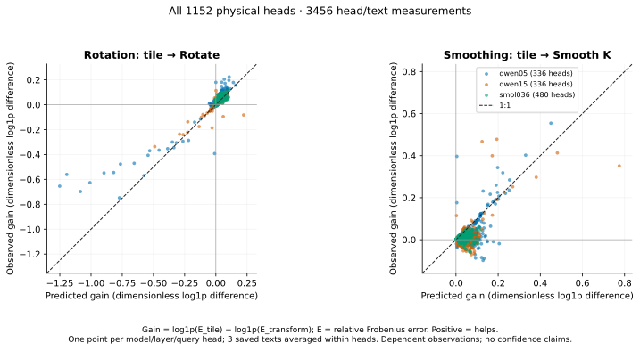
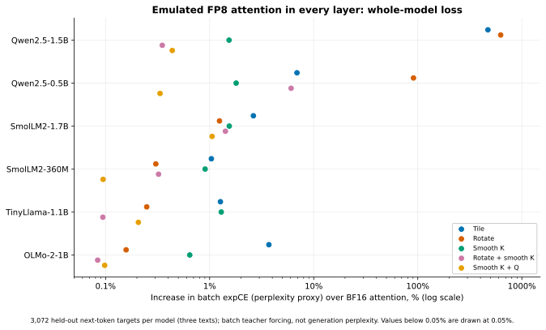

# attention-numerics

I emulate FP8 attention on a CPU to find out when rotating queries and keys before rounding, the outlier fix in FlashAttention-3, makes attention worse instead of better.

**Question:** Which heads does rotation hurt, can a model of rounding noise predict them in advance, and does it change the whole model's loss?

**Result:** Rotation made attention less accurate in 250 of the 2,880 heads I measured across six open models. I committed the predictor and its threshold in [f756745](https://github.com/mottopanikeiku/attention-numerics/commit/f756745) before loading three of the models. On those 1,728 unseen heads it finds the 132 harmed ones with AUC 0.978 (precision 73%, recall 79%). The damage reaches the output: with emulated FP8 attention in every layer, rotation raises Qwen2.5-0.5B's perplexity 1.91×. Subtracting the mean key first brings that to 1.06×. [Risk](results/v2/rotation_risk.json), [loss](results/v2/summary.json).

## What I built

[study/attention.py](study/attention.py) emulates tiled E4M3 attention with FlashAttention-3's random-sign Hadamard rotation and SageAttention's key smoothing. [study/prediction.py](study/prediction.py) predicts each head's error from rounding-noise statistics, with no fitted parameters. [study/stream.py](study/stream.py) runs native BF16 models one layer at a time, so 1.5B models fit in 2 GB. The FP8 conversion matches PyTorch on all 65,536 BF16 bit patterns ([validation](results/v2/validation/)).

## Which heads rotation hurts

Six checkpoints from four families, every layer and head, three public-domain texts of 1,024 tokens ([models](data/v2/models.json), [per-head data](results/v2/heads.csv)). A head is harmed when its rotated error, averaged over the texts, exceeds its unrotated error.

| Model | Heads harmed | AUC | Precision | Recall |
|---|---:|---:|---:|---:|
| Qwen2.5-0.5B | 63 / 336 | 0.974 | 74% | 92% |
| Qwen2.5-1.5B | 36 / 336 | 0.936 | 71% | 89% |
| SmolLM2-360M | 19 / 480 | 0.954 | 54% | 79% |
| SmolLM2-1.7B, unseen | 73 / 768 | 0.977 | 70% | 82% |
| TinyLlama-1.1B, unseen | 59 / 704 | 0.982 | 79% | 75% |
| OLMo-2-1B, unseen | 0 / 256 | — | — | — |

I developed the predictor on Qwen2.5-0.5B and SmolLM2-360M ([design](data/v2/design.json)). OLMo has no harmed heads, so AUC and recall are undefined; the predictor raised one false alarm there. The damage sits early. In layer 0, rotation hurts every head in both Qwen models, 29 of 32 in SmolLM2-1.7B and 26 of 32 in TinyLlama. Only one of the 132 harmed unseen heads is an attention sink ([counts](results/v2/rotation_risk.json)).



The predictor ranks heads well (rank correlation 0.90 on unseen heads), but it is no general error model: unseen error levels have R² 0.50, and it fails to predict the other transformations' gains (R² 0.003) ([fit](results/v2/fit.json)).

## Why rotation can hurt

In these heads every key carries the same large vector. It adds the same number to all of a query's scores, which softmax cancels. Unrotated, the shared vector sits in a few channels where keys hold nearly equal values, so they round alike and that error cancels too. Rotation spreads it across every channel, so each element is dominated by the shared part. FP8's three mantissa bits then round the token-specific part coarsely and differently for each key, which softmax cannot cancel ([derivation](docs/V2_PREDICTION.md)).

## Whole-model loss

Every attention layer is replaced by the emulation; the rest stays native BF16. Entries are perplexity ratios against BF16 attention over 3,072 held-out next tokens per model ([raw](results/v2/downstream.csv)).

| Model | Tile | Rotate | Smooth K | Rotate + smooth K | Smooth K + Q |
|---|---:|---:|---:|---:|---:|
| Qwen2.5-0.5B | 1.069 | **1.909** | 1.018 | 1.061 | 1.003 |
| Qwen2.5-1.5B | **5.722** | **7.260** | 1.015 | 1.004 | 1.004 |
| SmolLM2-360M | 1.010 | 1.003 | 1.009 | 1.003 | 1.001 |
| SmolLM2-1.7B | 1.026 | 1.012 | 1.015 | 1.014 | 1.011 |
| TinyLlama-1.1B | 1.013 | 1.002 | 1.013 | 1.001 | 1.002 |
| OLMo-2-1B | 1.037 | 1.002 | 1.006 | 1.001 | 1.001 |

Qwen2.5-1.5B breaks under per-tile FP8 even without rotation; rotation makes it worse. "Smooth K" subtracts the mean key, which leaves exact attention unchanged; "Smooth K + Q" also centers queries, with SageAttention2's correction.



## Reproduce

CPU only, $0 paid compute (Ryzen AI 5 PRO 340, Linux), 16.4 GB of model downloads. Repeat the last command until it reports completion ([details](docs/REPRODUCE.md)).

```sh
uv sync --locked --extra capture --python 3.13
export OPENBLAS_NUM_THREADS=1 OMP_NUM_THREADS=1 MKL_NUM_THREADS=1
timeout 580 nice -n 19 uv run --extra capture python -m study.pipeline --model all --seconds 500
```

## Limits

- A CPU emulation of E4M3 rounding, not FlashAttention-3 or SageAttention on FP8 hardware.
- Six small models, three English texts; heads are not independent, so no confidence intervals.
- Loss uses teacher forcing on whole windows; key means and tile scales see the full window, unlike a streaming decoder.
- The predictor needs the ideal attention output: a diagnostic, not a runtime switch.
- Exact layer-streaming parity was checked on Qwen2.5-0.5B, other architectures on tiny models.

## Prior work

[FlashAttention-3 §3.3](https://arxiv.org/html/2407.08608v1#S3.SS3) introduced rotation ("incoherent processing") for FP8. [SageAttention](https://arxiv.org/html/2410.02367v9#S4.SS2) and [SageAttention2](https://arxiv.org/html/2411.10958v7#S3.SS1) smooth K and Q; [QuaRot](https://arxiv.org/abs/2404.00456) and [SmoothQuant](https://arxiv.org/abs/2211.10438) fight outliers with rotation and scaling. [Comparison with each](docs/PRIOR_WORK.md), [cold reviews](docs/REVIEW.md), [earlier synthetic studies](docs/MODEL.md).

Written with AI coding assistance.
