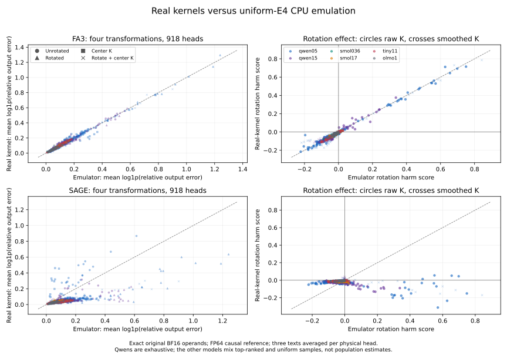

# attention-numerics

I test whether a CPU model of quantized-attention error predicts real GPU kernels.

**Question:** Does rotating queries and keys before rounding hurt real attention heads, and does that damage reach the model's loss?

I use the published [FA3](https://github.com/Dao-AILab/flash-attention/tree/main/hopper) and [SageAttention](https://github.com/thu-ml/SageAttention) kernels. My [reference](study/hardware/common.py) reuses exact BF16 captures; the [runner](study/hardware/worker.py) measures H100/L4 errors and FA3 model loss. I test the unchanged [rounding-noise predictor](study/prediction.py).

**Result:** The failure is real. With FA3 FP8 in every layer, rotating Q/K raises Qwen2.5-1.5B's batch exp-CE ratio to **12.56×** versus native BF16. Centering K first brings it to **1.004×**. The predictor ranks FA3 harm well, but its unchanged threshold produces **118 false alarms for only 5 harmed Qwen heads** under Sage. [Measurements](results/hardware/summary.json).

[Interactive version: the mechanism and earlier 2,880 emulated heads](https://mottopanikeiku.github.io/attention-numerics/).

## Real-kernel loss

Each model uses 3,072 heldout next-token labels from three public-domain books. Only attention changes; projections, RoPE, norms and MLP remain native BF16. Entries are `exp(CE_variant − CE_BF16)`, **batch teacher forcing, not streaming decoder perplexity**. [Raw FA3 run](results/hardware/fa3.json.gz), [summary](results/hardware/summary.json).

| Qwen2.5 | BF16 CE | Unrotated | Rotated | Center K | Rotate + center K |
|---|---:|---:|---:|---:|---:|
| 0.5B | 2.9944 | 1.071× | **2.032×** | 1.018× | 1.056× |
| 1.5B | 2.4103 | **4.808×** | **12.560×** | 1.014× | **1.004×** |

The earlier CPU emulator's 5.722×/7.260× increases on 1.5B were not quantitatively accurate: actual FA3 rotation is worse, not absent. I use a matched GPU BF16 baseline, not the earlier CPU baseline. [Earlier loss](results/v2/summary.json).

## Which heads transfer?

I selected [918 physical heads before GPU outcomes](https://github.com/mottopanikeiku/attention-numerics/tree/2780eaf927afe4a719b714cfd4016af13acd7829/data/hardware): every head in both Qwens, plus top-ranked and independent uniform samples from SmolLM2-360M/1.7B, TinyLlama-1.1B and OLMo-2-1B. Every selected head uses the same three 1,024-token captures. Overlapping samples are measured once; top-rank enrichment is not a population estimate. [Selection](data/hardware/selection.json).

For the **672 exhaustive Qwen heads**, the unchanged predictor's zero threshold gives:

| Kernel | Rotation harms | AUC | Precision / recall | Accuracy / majority baseline |
|---|---:|---:|---:|---:|
| FA3, H100 | 87 / 672 | 0.956 | 64% / 91% | 92.3% / 87.1% |
| Sage, L4 | 5 / 672 | 0.966 | **4% / 100%** | **82.4% / 99.3%** |

Sage's high AUC does not make the threshold useful: there are very few positives and many false alarms. Across all selected heads, emulator/kernel **unrotated** error-rank correlation is 0.992 for FA3 and 0.850 for Sage; rotation-effect correlation is 0.982 versus 0.263. They disagree on whether rotation hurts in 28 versus 146 heads. [Stratum statistics and disagreements](results/hardware/summary.json).



## Why this happens

A common vector in K adds a row-constant score, which exact softmax cancels. Rotation can spread that large vector across channels, coarsening the token-specific residual during rounding. Subtracting the mean key preserves exact attention while reducing that numerical problem. [Derivation](docs/V2_PREDICTION.md).

The APIs are not the emulator: FA3 uses full-sequence head scales, native FP8 tensor-core accumulation and a different probability scale. Sage uses INT8 Q/K, per-channel FP8 V and BF16 transform narrowing. I preserve the same Q/K Hadamard; V is never rotated. These differences change together, so I do not isolate one as the cause. [Settings and provenance](docs/REPRODUCE.md#real-kernel-comparison).

## Earlier prediction study

I [published the predictor and threshold](https://github.com/mottopanikeiku/attention-numerics/tree/prediction-locked) before loading three evaluation models. On their 1,728 emulated heads, AUC was 0.978. It uses operand rounding-noise second moments and ideal softmax/output sensitivity—not measured FP8 outputs. It is expensive, not a runtime controller; unseen error-level R² was 0.50 and pooled transformation-gain R² only 0.003. [CPU results](results/v2/rotation_risk.json), [fit](results/v2/fit.json).

## Reproduce

My complete cloud cost bound was **$0.87**, including failed image builds and pilots, not an invoice ([cost](results/hardware/cost.json)). Prepare the operand Volume using the [committed capture pipeline and upload instructions](docs/REPRODUCE.md#real-kernel-comparison): original CPU capture cost $0 paid compute and 16.4 GB of model files. The pinned bundle is private, not currently downloadable; [all input hashes](data/hardware/operands.json) are committed.

```sh
uv sync --locked --extra capture --extra hardware
ATTENTION_BACKEND=fa3 ATTENTION_GPU=H100 ATTENTION_MINUTES=15 ATTENTION_MEM_GIB=32 uv run modal run study/hardware/modal_app.py --mode full --output results/hardware/fa3.json.gz
ATTENTION_BACKEND=sage ATTENTION_GPU=L4 ATTENTION_MINUTES=15 uv run modal run study/hardware/modal_app.py --mode full --output results/hardware/sage.json.gz
```

## Limits and prior work

- Six small checkpoints, three books and one context length; no task-general claim.
- Batch means/scales may see later tokens; no generation or latency benchmark.
- Sage has per-head comparisons only; downstream loss was measured for FA3.
- Exact operand reproduction depends on access to the private bundle or rebuilding matched captures/results.

Built on [FlashAttention-3](https://arxiv.org/abs/2407.08608), [SageAttention](https://arxiv.org/abs/2410.02367) and [SageAttention2](https://arxiv.org/abs/2411.10958), using their actual published kernels; [attribution and distinctions](docs/PRIOR_WORK.md).

Written with AI coding assistance.
