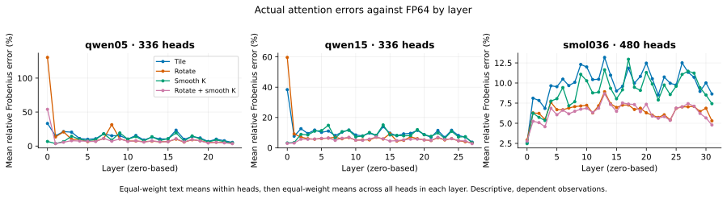

# attention-numerics

This is a CPU study of when FP8 attention's shared Q/K rotation helps—or hurts—real language-model heads.

**Question:** Can quantization-noise statistics predict the rare heads rotation harms, and does the choice matter to whole-model loss?

[study/prediction.py](study/prediction.py) predicts output error; [study/attention.py](study/attention.py) implements tiled E4M3 with FA3/Sage-inspired transformations; [study/stream.py](study/stream.py) streams native BF16 layers. Original code, **not GPU kernels**.

**Result:** On three untouched models, the parameter-free rotation-risk score reaches **AUC 0.978**, **88.17% balanced accuracy**, and **96.12% accuracy versus a 92.36% majority baseline**. Rotation nevertheless raises Qwen0.5's batch CE from **2.994 to 3.641**. [Risk](results/v2/rotation_risk.json), [loss](results/v2/summary.json).

## Predicting rotation harm

**Six checkpoints, four families, all 2,880 heads/every layer**; three public-domain texts, **1,024 causal tokens** each. [Pins](data/v2/models.json), [attributed texts](data/v2/texts.json), [head errors/features](results/v2/heads.csv).

Predictions were fixed in [f756745](https://github.com/mottopanikeiku/attention-numerics/commit/f756745) **before evaluation**. Qwen0.5 and Smol360 are development models; Qwen0.5/Qwen1.5 fit the separately reported affine calibration. Smol1.7, TinyLlama and OLMo were untouched until the prediction code, zero threshold and model list were published. [Design](data/v2/design.json).

Each head averages three text-level `log1p(relative Frobenius error)` values. Observed harm means rotated log-error exceeds tile; the classifier uses predicted counterparts. Untouched rotation gain has **Spearman 0.902 / R² 0.760**, **72.73% precision / 78.79% recall**, and **132 harmed heads / 1,728**. Observations are dependent. [Definitions and denominators](results/v2/rotation_risk.json).

| Model | Hurt % | Majority % | Balanced % | AUC | Precision % | Recall % |
|---|---:|---:|---:|---:|---:|---:|
| Qwen0.5 | 18.75 | 81.25 | 92.37 | .974 | 74.36 | 92.06 |
| Qwen1.5 | 10.71 | 89.29 | 92.28 | .936 | 71.11 | 88.89 |
| Smol360 | 3.96 | 96.04 | 88.06 | .954 | 53.57 | 78.95 |
| Smol1.7 — test | 9.51 | 90.49 | 89.23 | .977 | 69.77 | 82.19 |
| TinyLlama1.1 — test | 8.38 | 91.62 | 86.36 | .982 | 78.57 | 74.58 |
| OLMo2-1B — test | 0 | 100 | — | — | 0 | — |

[Risk data](results/v2/rotation_risk.json). OLMo has no harmed heads: AUC/balanced accuracy/recall are undefined, with one false alarm.


Untouched error-level **R² is 0.501**, **0.667 after Qwen-only calibration**, **Spearman 0.837**. Pooled three-transformation gain **R² is only 0.003**, not a general quality predictor. [Fit and failures](results/v2/fit.json).

### Mechanism

A common key component adds the same scalar to every allowed logit of a query and cancels in exact softmax. Quantization can turn it into key-dependent noise; an orthogonal rotation preserves exact dot products, not their rounded versions. The predictor contracts Q/K noise covariances with the ideal softmax/output Jacobian. It omits P/V/output rounding and higher-order softmax effects. “Smooth K” removes the key mean; “Smooth KQ” also centers query blocks with the required key-dependent correction. [Derivation and omissions](docs/V2_PREDICTION.md).



Harm is concentrated in layers 0/1/2 for the two harmed test models. Only **1/132** harmed test heads meets the fixed prefix-sink label: mean first-four-token mass ≥0.5 over queries 128–1023. This is a descriptive association, not a causal explanation. [Layer/sink counts](results/v2/rotation_risk.json), [raw masses](results/v2/sinks.csv).

## All-layer downstream effects

Every attention layer is replaced; other computation remains native BF16. Cells below are **ΔCE / KL(BF16‖variant)** in nats/token; row labels give BF16 CE. Each model uses **3,072 matched next-token targets** from disjoint, reset-context text windows, without chat templates. **Batch teacher forcing**, not streaming-decoder perplexity: centering and block calibration can use later batch tokens. [Raw CE/expCE/full-vocabulary KL](results/v2/downstream.csv), [aggregates](results/v2/summary.json).

| Model (BF16 CE) | Tile | Rotate | Smooth K | Rotate + smooth K | Smooth KQ |
|---|---:|---:|---:|---:|---:|
| Qwen0.5 (2.994) | .0668/.0501 | .6467/.6106 | .0178/.0147 | .0589/.0493 | .0033/.0043 |
| Qwen1.5 (2.411) | 1.7443/1.6360 | 1.9824/1.8970 | .0153/.0118 | .0035/.0058 | .0044/.0035 |
| Smol360 (2.677) | .0103/.0142 | .0030/.0080 | .0090/.0103 | .0032/.0064 | .0009/.0035 |
| Smol1.7 (1.833) | .0260/.0334 | .0124/.0203 | .0153/.0296 | .0141/.0182 | .0105/.0076 |
| TinyLlama1.1 (2.312) | .0126/.0111 | .0025/.0047 | .0128/.0093 | .0009/.0044 | .0021/.0020 |
| OLMo2-1B (2.108) | .0364/.0342 | .0016/.0090 | .0064/.0123 | .0008/.0048 | .0010/.0026 |

Rotation helps most heads but can still worsen loss. Qwen0.5/Qwen1.5 rotated **expCE ratios are 1.91×/7.26×** versus BF16; smoothing nearly repairs them. [Token-weighted expCE](results/v2/summary.json).


## Reproduce

CPU, **$0 paid compute**; AMD Ryzen AI 5 PRO 340, Linux, bounded Torch threads/single-thread BLAS. **16.36 GB pinned weights**, plus captures; larger models load one decoder layer. Repeat until complete. [Runtime](results/v2/machine.json), [inputs](data/v2/models.json), [checks/reproduction](docs/REPRODUCE.md).

```sh
uv sync --locked --extra capture --python 3.13
export OPENBLAS_NUM_THREADS=1 OMP_NUM_THREADS=1 MKL_NUM_THREADS=1
timeout 580 nice -n 19 uv run --extra capture python -m study.pipeline --model all --seconds 500
```

## Limits and checks

- Uniform E4M3 CPU surrogate, not FA3/Sage hardware arithmetic or GPU accuracy/speed.
- Small model/text collection; correlated heads and repeated texts; no confidence claims or pretraining-exclusion guarantee.
- Predictor needs ideal reference attention: a diagnostic, not a cheap runtime selector.
- Batch calibration is not streaming/generation; local head error does not establish which heads cause downstream loss.
- Full native parity tested on small Qwen; architecture tests use real tiny models. [Validation](results/v2/validation/): **180 captured-head cases** versus the independent emulator (maximum relative difference **0.0122%**); **all 65,536 BF16 patterns**, **zero raw/saturating E4M3FN byte mismatches** on CPU Torch.

## Prior work

[FA3 §3.3](https://arxiv.org/html/2407.08608v1#S3.SS3), [SageAttention §4.2](https://arxiv.org/html/2410.02367v9#S4.SS2), [SageAttention2 §3.1](https://arxiv.org/html/2411.10958v7#S3.SS1), [QuaRot](https://arxiv.org/abs/2404.00456), [SmoothQuant](https://arxiv.org/abs/2211.10438), and the sink/outlier literature. [Detailed comparison and primary-source citations](docs/PRIOR_WORK.md); [cold reviews](docs/REVIEW.md). Earlier synthetic context/accumulation studies and matched shared-component controls remain under [`results/`](results/) and [MODEL.md](docs/MODEL.md).

Written with AI coding assistance.
