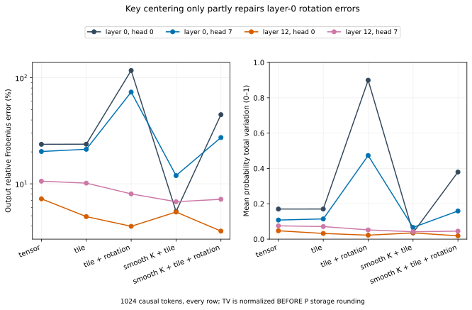

# attention-numerics

This is a NumPy emulation of rounding error in tiled BF16 and FP8 attention, **not a measurement on GPU hardware**.

**Question:** How much error comes from low-precision inputs and accumulation, how does context length change it, and which fixes help?

[attention.py](attention.py) models conversion, accumulation and online softmax; [sweep.py](sweep.py) compares it with an independent chunked float64 reference. [diagnosis.py](diagnosis.py) separates score-driven attention changes from later rounding. The algorithms build on FlashAttention, SageAttention and the quantization papers below; implementation code is original.

**Result:** Rotation can make a shared component harmful. Key-mean subtraction helps the captured failure, but does not completely repair it.

## On actual model operands

Pinned Qwen2.5-0.5B-Instruct, BF16 post-RoPE Q/K/V, one public-domain text, **1024 causal tokens, every query row**. Relative Frobenius error in percent; column labels are zero-based layer/head. [Capture and licenses](data/NOTICE), [raw results](results/diagnosis.csv).

| E4M3 condition | 0/0 | 0/7 | 12/0 | 12/7 |
|---|---:|---:|---:|---:|
| Tensor scale | 23.59 | 20.19 | 7.22 | 10.59 |
| Tile scale | 23.65 | 21.17 | 4.91 | 10.16 |
| Tile + rotation | 117.07 | 73.25 | 3.98 | 8.04 |
| Smooth K + tile | 5.49 | 11.96 | 5.42 | 6.78 |
| Smooth K + tile + rotation | 44.88 | 27.32 | 3.58 | 7.15 |

“Smooth K” subtracts its token-mean vector before quantization. Q is **not** centered: that requires a key-dependent correction, as in SageAttention2.

The two layer-0 reference output norms are **4.508 / 3.193**. At their worst rotated rows, normalized probability total variation is **0.988 / 0.982**, with different top keys: this really moves attention mass. TV is measured **before probability storage rounding**. [Norms, row indices, distributions and qualifications](docs/MODEL.md#rotation-diagnosis).

The existing-tool baseline, PyTorch CPU SDPA/BF16, has **0.17375%** four-head median error versus **0.17378%** for the BF16 emulator, and wins on one individual head. [Same operands and mask](results/real.csv); not a GPU comparison.

### Why rotation can fail

Layer-0 K stores 94.8–97.5% of its energy in the token mean. A shared key component shifts each query's logits equally and cancels in softmax. Rotation mixes that component with token-specific signal; rounding can then shift different keys differently. An exactly constant-channel control reproduces this: rotation raises median error from 4.65% to 40.77%, while it helps varying outliers (43.01% to 4.31%). Centering K reduces—but does not eliminate—the real failure. This supports the shared-component mechanism, not projection bias as the sole cause. FP8 already stores an exponent per value, so spreading outliers helps less predictably than on an integer grid.

[Mean energies](results/means.csv); [matched controls](results/bias-controls.csv): channel value/multiplier 32, N=1024, d=64, causal, three seeds; V unchanged. Additive bias retaining channel variation is a separate control, not equivalent to an exactly constant channel.



## Does longer context alone dominate?

For Gaussian inputs, error changes little across 1k–64k keys. Constructed outliers matter more. Below: 64k keys, d=64, non-causal, **128 fixed query rows**, three-seed medians [min–max], percent. [Raw data](results/length.csv), [sampling](docs/MODEL.md).

| Condition | Gaussian σ=1 | One Q/K/V channel ×8 |
|---|---:|---:|
| BF16 | 0.379 [0.362–0.384] | 2.50 [1.30–3.68] |
| E4M3 tensor | 5.38 [5.22–5.43] | 36.3 [11.0–45.6] |
| E4M3 tile | 5.42 [5.07–5.47] | 3.85 [3.28–4.02] |
| E4M3 tile + rotation | 5.36 [5.17–5.42] | 8.25 [3.85–8.63] |

A separate **all-65,536-query, one-seed** Gaussian check gives FP32 **0.0000914%**, BF16 **0.3794%**, E4M3 tensor **5.4585%**; global maxima and worst rows are in [full64.csv](results/full64.csv).

Promotion helps [genuinely long reduced14 dot products](results/dots.csv), not the default 128-key-tile attention case. Compensation helps an [isolated denominator construction](results/denominator.csv), not generally total attention error.

## Reproduce

Committed data need CPU only, no model download, **$0 paid compute**:

```sh
uv sync --locked --python 3.13
uv run pytest -q
uv run python figures.py
```

Experiments used AMD Ryzen AI 5 PRO 340, Linux, single-thread BLAS. [Experiment versions](results/diagnosis.json), [exact sweeps, diagnosis and capture commands](docs/REPRODUCE.md).

## Limits

- Explicit rounding surrogate, not bit-exact H800 or a FlashAttention/SageAttention reproduction.
- Synthetic data and one small model, four heads, one text; no downstream quality evaluation.
- Long-context sampling is not a global worst-case bound; full64 covers one seed/setting.
- Three-seed ranges are not confidence intervals. Prefix captures are correlated.
- Full-K batch centering is not streaming; no GPU accuracy or speed claim.

## Prior work

[FlashAttention](https://arxiv.org/abs/2205.14135), [FA2](https://arxiv.org/abs/2307.08691), [FA3](https://arxiv.org/abs/2407.08608); [SageAttention, ICLR 2025, §4.2](https://arxiv.org/html/2410.02367v9#S4.SS2); [SageAttention2, ICML 2025, §3.1–3.4](https://arxiv.org/html/2411.10958v7#S3.SS1); [FP8 Formats](https://arxiv.org/abs/2209.05433), [DeepSeek-V3 §3.3.2/§3.5.2](https://arxiv.org/html/2412.19437v2#S3.SS3.SSS2), [QuaRot](https://arxiv.org/abs/2404.00456). [Precise attribution and quotations](docs/PRIOR_WORK.md); [cold review](docs/REVIEW.md).

Written with AI coding assistance.
