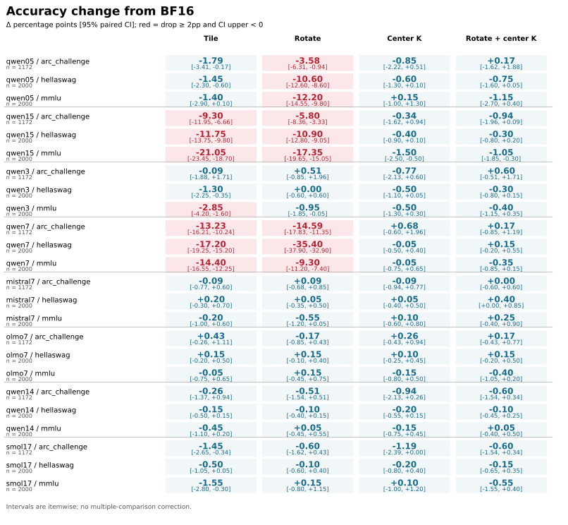

# attention-numerics

I measure how FP8 attention changes multiple-choice answers.

**Question:** Does rotating queries and keys before rounding hurt answer accuracy, and does centering keys first help?

Using published [FlashAttention-3](https://arxiv.org/abs/2407.08608) and pinned [lm-evaluation-harness prompts](docs/PRIOR_WORK.md#fixed-item-multiple-choice-evaluation), my [data preparation](study/accuracy/data.py) fixes the items, [scorer](study/accuracy/worker.py) changes attention in every layer, and [reporter](study/accuracy/report.py) pairs answers with native GPU BF16. Projections, RoPE, norms and MLP remain native.

**Result:** Rotation drops Qwen2.5-7B HellaSwag accuracy by **35.40 percentage points**, paired 95% CI **[−37.90, −32.90]**. Both centered variants have **zero ≥2pp harm flags across 48 comparisons**, but are not lossless. [All measurements](results/accuracy/summary.json).

[Interactive mechanism and earlier emulated-head study](https://mottopanikeiku.github.io/attention-numerics/).

## Answer accuracy

Eight checkpoints, four families, five attention variants, one H100: full **1,172-item ARC-Challenge test**, seeded **2,000-item HellaSwag validation** and subject-stratified **2,000-item MMLU test**, all zero-shot without chat templates. ARC/HellaSwag use character-normalized continuation likelihood; MMLU scores answer letters without normalization. [Item IDs, prompts and source revisions](data/accuracy/selection.json).

The table gives BF16 accuracy percentages and the count of flagged FP8 comparisons. A flag requires a drop **≥2pp** and a paired bootstrap interval whose upper endpoint is below zero. There are 12 comparisons per checkpoint: three tasks × four nonbaseline variants. [Point estimates, all 95% intervals and raw-file hashes](results/accuracy/summary.json).

| Checkpoint | ARC | HellaSwag | MMLU | Harm flags / 12 |
|---|---:|---:|---:|---:|
| Qwen2.5-0.5B-Instruct | 33.87 | 53.75 | 44.75 | 3 |
| Qwen2.5-1.5B-Instruct | 46.84 | 69.55 | 61.95 | 6 |
| Qwen2.5-3B-Instruct | 48.38 | 76.80 | 65.00 | 1 |
| Qwen2.5-7B-Instruct | 55.20 | 80.90 | 71.60 | 6 |
| Qwen2.5-14B-Instruct | 62.29 | 85.40 | 78.75 | 0 |
| Mistral-7B-v0.3 | 54.35 | 81.50 | 58.40 | 0 |
| OLMo-2-1124-7B | 57.17 | 81.25 | 59.50 | 0 |
| SmolLM2-1.7B | 47.44 | 72.95 | 48.60 | 0 |

The other three families are **base** checkpoints, so this is not a controlled ranking of family quality. Damage is not monotone with size: 7B Qwen is much worse than 14B here. Centering also leaves smaller losses: Qwen1.5B MMLU falls **1.50pp [−2.50, −0.50]** with `smooth_k`, below the chosen flag threshold.



`tile` names unrotated FA3 with **full-sequence per-head scales**, not the earlier block-scaled emulator. `rotate` applies a shared signed Hadamard to Q/K; `smooth_k` subtracts the key mean; `rotate_smooth_k` does both. V is never rotated.

## Why centering can help

A shared key vector adds the same offset to every visible score in a query row; exact softmax cancels it. Rotation can spread that vector across channels and coarsen the token-specific residual during rounding. Removing it preserves exact attention, not necessarily quantized attention. The results support a contributor, not one universal cause. [Derivation and earlier controls](docs/V2_PREDICTION.md).

The earlier real-kernel study measured a **12.56× batch exp-CE ratio** for rotated Qwen1.5B and **1.004×** after centering. It also showed that high predictor AUC can coexist with poor Sage threshold precision. These are separate numerical/loss experiments, not task-accuracy forecasts. [Earlier results](results/hardware/summary.json).

## Reproduce

Recompute the table and figure from committed compressed item records on CPU, with **$0 paid compute**:

```sh
uv sync --locked --python 3.13
uv run python -m study.accuracy.report --additional-plan data/accuracy/qwen14-plan.json --additional-plan data/accuracy/smol17-plan.json
```

Repeating model scoring requires **H100 80GB** for the native FA3 FP8 API. CPU-only cloud stages download/hash weights and tokenize before GPU allocation. The complete new-study compute bound is **$4.77 including the failed preparation and pilot**, not an invoice; downloaded checkpoint copies were removed afterward. [Cost accounting](results/accuracy/cost.json); [full stages, licenses, methods and review](docs/REPRODUCE.md#fixed-item-multiple-choice-accuracy).

## Limits and prior work

- Fixed samples and standard zero-shot prompts, not chat or task-general ability.
- Itemwise intervals, no multiple-comparison correction; absence of a flag is not equivalence.
- Full-sequence scales/means can see later tokens: batch scoring, not streaming generation.
- One GPU/kernel configuration; no latency or memory-saving benchmark, no new-model risk forecast.
- Qwen3B is noncommercial research/evaluation only; the other model checkpoints are Apache-2.0. No weights are redistributed.

Built on [FlashAttention-3](https://arxiv.org/abs/2407.08608), earlier [SageAttention](https://arxiv.org/abs/2410.02367) comparisons and [lm-evaluation-harness](https://github.com/EleutherAI/lm-evaluation-harness/tree/ad3f4d0cad1cfcdb815f1e795f7947e49ed9f2e9); upstream work is attributed, not presented as my kernel.

Written with AI coding assistance.
